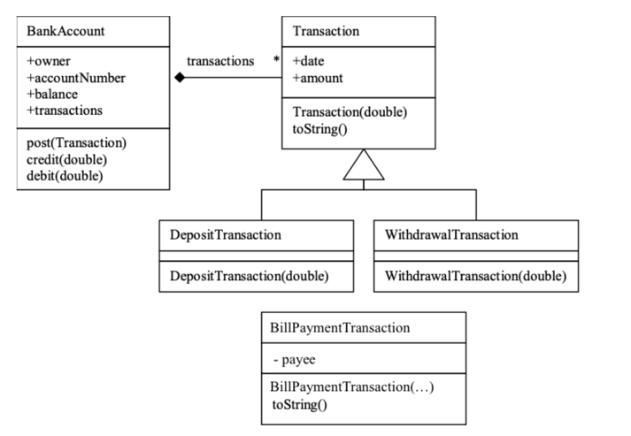

# Simple Banking Backend Project

A Simple Banking backend application implemented in Java 21 with Spring Boot 3.2.3

This backend application provides simple banking operations like account creation, money transfer, etc.

The following diagram shows how BankAccounts and Transactions are related.



# How to Test
The following code demonstrates how BankAccounts might be used.  Use services and repositories to persist your model above into a Database using JPA.

Create an account:
```bash
curl --location 'http://localhost:8080/account/v1/createBankAccount' \
--header 'Content-Type: application/json' \
--data '{
    "accountNumber": "669-7788",
    "owner": "Ufuk ORHAN",
    "balance": 1000
}'
```

To deposit money into an account, one would use:
```bash
curl --location --request POST 'http://localhost:8080/account/v1/credit/669-7788' \
--header 'Content-Type: application/json' \
--header 'Accept: application/json' \
--data-raw '    {
        "amount": 200
    }'
    
response would be (200):
{
    "status": "OK",
    "approvalCode": "67f1aada-637d-4469-a650-3fb6352527ba"
}
```
To withdraw money:
```bash
curl --location --request POST 'http://localhost:8080/account/v1/debit/669-7788' \
--header 'Content-Type: application/json' \
--header 'Accept: application/json' \
--data-raw '    {
        "amount": 100
    }'

response would be (200):
{
    "status": "OK",
    "approvalCode": "a66cce54-335b-4e46-9b49-05017c4b38dd"
}
```
To get the current account data, one would use:
```bash
curl --location --request GET 'http://localhost:8080/account/v1/669-7788'

response would be:

{
    "accountNumber": "669-7788",
    "owner": "Ufuk Orhan",
    "balance": 1100.00,
    "createDate": "2020-03-26T06:15:50.550+0000",
    "transactions": [
        {
            "date": "2020-03-26T06:16:03.563+0000",
            "amount": 200.00,
            "type": "DepositTransaction",
            "approvalCode": "67f1aada-637d-4469-a650-3fb6352527ba"
        },
        {
            "date": "2020-03-26T06:16:35.047+0000",
            "amount": 100.00,
            "type": "WithdrawalTransaction",
            "approvalCode": "a66cce54-335b-4e46-9b49-05017c4b38dd"
        }
    ]
}
```